# Chapter 1 - AWS EC2 & Nginx 설치

### 1. AWS 환경 준비

-   AWS 계정 생성 및 프리 티어 활성화
-   EC2 인스턴스 생성(t3.micro)
    -   OS: Amazon Linux 2023 kernel-6.1 AMI
    -   보안그룹: SSH(22), HTTP(80), HTTPS(443) 허용
    -   스토리지 구성: 20GB(AWS 무료 티어는 최대 30GB까지 제공)
      
### 2. EC2 접속 및 키 페어 설정

-   인스턴스 생성 시 injin-key.pem 키 페어 발급
-   인스턴스 -> 체크박스 클릭 후 연결 -> 퍼블릭 IP를 사용하여 연결
  
### 3. 기본 패키지 업데이트 및 시간 동기화

```bash
sudo dnf update -y
sudo timedatectl set-timezone Asia/Seoul
timedatectl # Local Time 부분 KST 확인
```

### 4. 웹 서버 설치 및 확인

```bash
sudo dnf install nginx -y
sudo systemctl start nginx
sudo systemctl enable nginx
sudo systemctl status nginx
```

-   브라우저 접속: http://3.107.193.223/
-   Nginx 기본 화면 ("Welcome to Nginx") 확인

    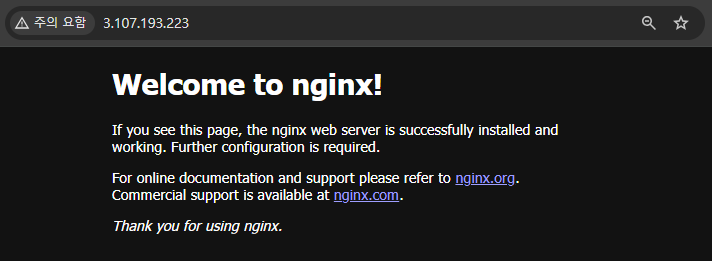

### 5. Git 연결

-   GitHub Repository 생성
-   EC2에서 OpenSSH 키 생성 및 GitHub SSH Keys 등록

```bash
ssh-keygen -t ed25519 -C "injin0318@gmail.com"
cat ~/.ssh/id_ed25519.pub # 해당 값 복사
```
-   GitHub에 SSH 키 등록
    -   오른쪽 상단 프로필 -> Settings -> SSH and GPG keys -> New SSH key -> Title: devops-lab-ec2, Key: 위에서 복사한 값 붙여넣기
-   Git 설치 및 초기 세팅

```bash
sudo dnf install git -y
git --version # 설치 확인
git config --global user.name "INJIN KIM" # 사용자 이름 등록
git config --global user.email "injin0318@gmail.com" # 사용자 이메일 등록
git config --list
```
-   Git 초기화 및 원격 연결
  
```bash
mkdir ~/devops-lab-ec2
sudo chown -R ec2-user:ec2-user ~/devops-lab-ec2
chmod 755 ~/devops-lab-ec2
cd ~/devops-lab-ec2

git init
git remote add origin git@github.com:INgenious-with/devops-lab-ec2.git
ssh -T git@github.com # yes 입력 후 정상 메시지 확인
git remote -v # 정상 확인

echo '<h1>Welcome to DevOps Lab EC2!</h1>' > check.html
git add .
git commit -m "commit check"
git branch -M main
git push origin main
```

✨ 느낀 점

AWS EC2를 직접 생성하고 Nginx를 띄워보며, 클라우드에서 서버가 구성되고 노출되는 과정을 직접 확인할 수 있었음

보안그룹 설정을 통해 접근 제어의 중요성을 다시 한번 느꼈고, 인프라 관리의 기본 원리를 실제로 적용해볼 수 있었음

<br><br>

# Chapter 2 - PuTTY & FileZilla 연결

### 1. PuTTY 연결

-   PEM → PPK 변환 (PuTTYgen 사용)
    - PuTTYGen -> File -> Load private key -> injin-key.pem 열기 -> Save private key
    
        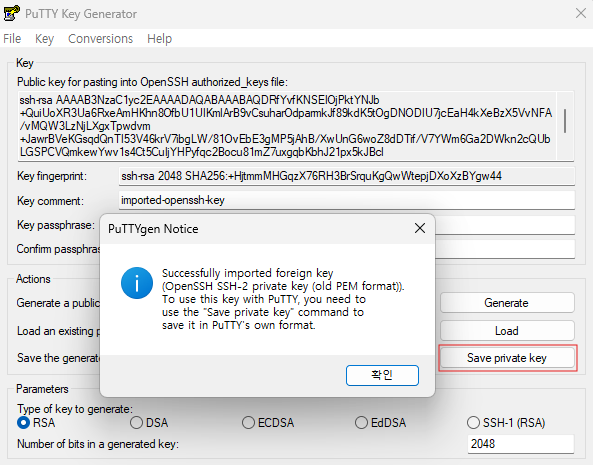
      
-   PuTTY 연결
    - Connection -> Auto-login username: ec2-user
    
        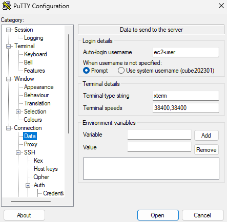
    
    - SSH -> Auth -> Credentials -> Private key file for authentication: injin-key.ppk 선택
    
        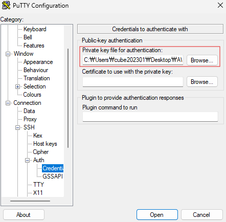
    
    - Session -> Host Name(or IP address): 3.107.193.223(퍼블릭 IP), Port: 22, Saved Sessions: devops-lab-ec2 -> Save -> Open
    
        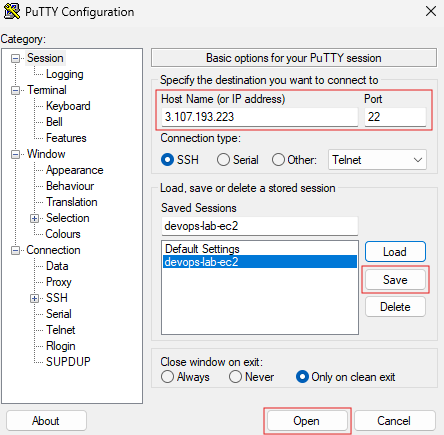
    
    - PuTTY 연결 시 Save 했던 devops-lab-ec2를 Load 해서 사용
    
        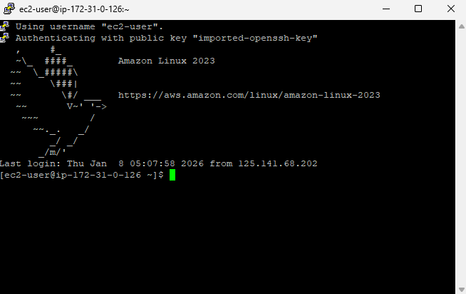

### 2. FileZilla 연결

-   사이트 관리자 및 연결 확인
    -   파일 -> 사이트 관리자 -> 새 사이트 -> 이름: devops-lab-ec2, 프로토콜: SFTP, 호스트: 3.107.193.223, 포트: 22,<br>로그온 유형: 키 파일, 사용자: ec2-user, 키 파일: injin-key.ppk 불러오기
      
        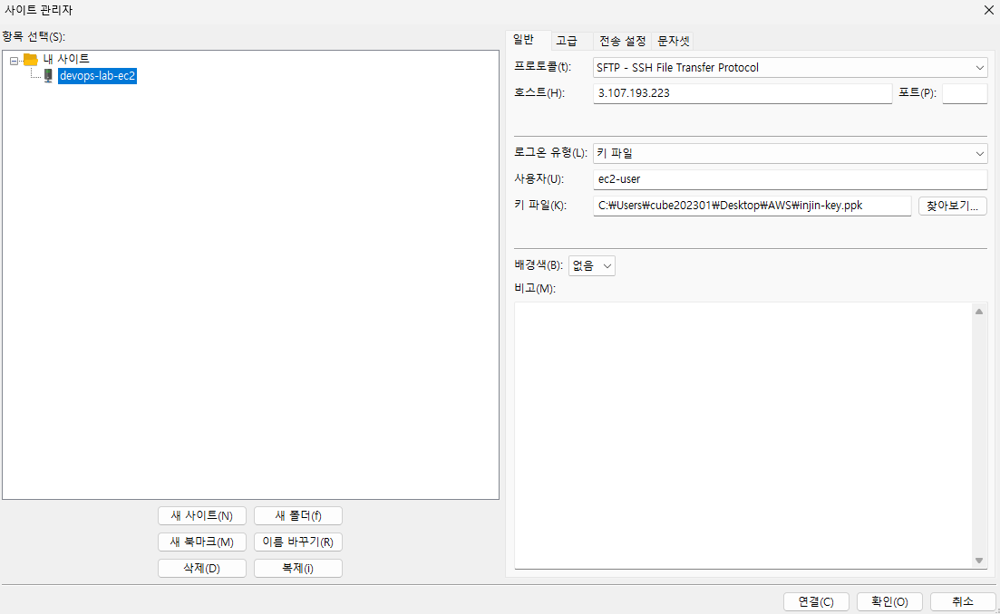

    -   FileZilla 연결 확인

        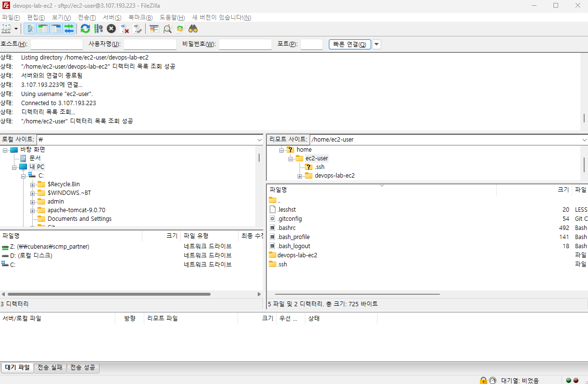
        
    
✨ 느낀 점

PuTTY를 이용해 injin-key.pem 키를 injin-key.ppk 키로 변환하고 세션을 등록하며, 익숙한 SSH 접속 과정을 클라우드 환경에서도 직접 구성해볼 수 있었음

또한 FileZilla를 통해 SFTP 연결을 설정하면서 로컬 환경처럼 서버 파일을 안전하게 전송하고 관리할 수 있음을 확인함

이번 과정을 통해 기존에 알고 있던 접근 방식이 AWS 환경에서도 동일하게 적용됨을 체험하며, 클라우드 운영의 실제 흐름을 이해할 수 있었음

<br><br>

# Chapter 3 - Docker 기초 및 커스텀 이미지 빌드

### 1. Docker 설치 및 실행

```bash
sudo dnf install docker -y
sudo systemctl start docker
sudo systemctl enable docker
sudo usermod -aG docker ec2-user
newgrp docker
```
   
### 2. 보안그룹 포트 추가(8080)

-   보안그룹 -> 해당 보안그룹 클릭 -> 인바운드 규칙 편집 -> 유형: 사용자 지정 TCP, 포트 범위: 8080, CIDR 블록: 0.0.0.0/0 -> 규칙 저장

### 3. 기본 컨테이너 실행 확인

```bash
docker run -d -p 8080:80 nginx
docker ps
```

-   브라우저 접속: http://3.107.193.223:8080
-   "Welcome to Nginx" 문구 확인

    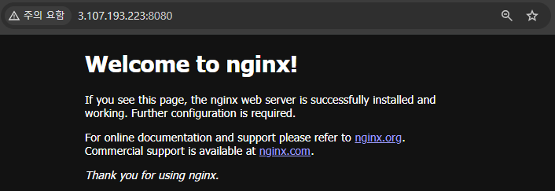

### 4. 커스텀 Docker 이미지 빌드

-   index.html 생성

```bash
echo '<h1>Hello from Docker!</h1>' > index.html
```

-   Dockerfile 작성

```bash
echo -e "FROM nginx\nCOPY index.html /usr/share/nginx/html/" > Dockerfile
```

-   이미지 빌드

```bash
docker build -t my-nginx .
```

-   커스텀 컨테이너 실행

```bash
docker run -d -p 8081:80 my-nginx
```

-   보안그룹 포트 추가(8081)
    -   보안그룹 -> 해당 보안그룹 클릭 -> 인바운드 규칙 편집 -> 유형: 사용자 지정 TCP, 포트 범위: 8081, CIDR 블록: 0.0.0.0/0 -> 규칙 저장    
-   브라우저 접속: http://3.107.193.223:8081
-   "Hello from Docker!" 문구 확인

    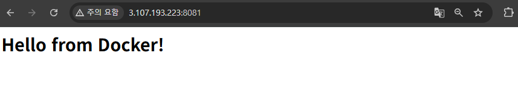

✨ 느낀 점

Dockerfile을 직접 작성하며 이미지와 컨테이너의 차이를 명확히 이해할 수 있었음

기존 서버 설정을 단 몇 줄의 코드로 재현할 수 있다는 점이 인상적이었고, ‘환경을 코드로 관리한다’는 DevOps 개념을 직접 체감할 수 있었음

<br><br>

# Chapter 4 - Jenkins 설치 및 CI/CD 파이프라인 설정

### 1. JDK(Java Development Kit) 설치

```bash
sudo dnf install java-17-amazon-corretto -y
sudo java -version # 설치 확인
```

-   Jenkins는 Java로 개발된 애플리케이션으로, 실행을 위해서 JDK를 먼저 설치하여야 함(Amazon Linux 2023은 JDK 17 이상 필수)

### 2. Jenkins 설치(저장소 추가 및 서명키 등록)

```bash
sudo wget -O /etc/yum.repos.d/jenkins.repo \
https://pkg.jenkins.io/redhat-stable/jenkins.repo
sudo rpm --import https://pkg.jenkins.io/redhat-stable/jenkins.io-2023.key
sudo dnf install jenkins -y
```

-   Amazon Linux에는 기본적으로 Jenkins 패키지가 포함되어 있지 않기 때문에 Jenkins 공식 저장소(repo) 를 직접 등록해야 함

### 2. 보안그룹 포트 추가(9090)

-   보안그룹 -> 해당 보안그룹 클릭 -> 인바운드 규칙 편집 -> 유형: 사용자 지정 TCP, 포트 범위: 9090, CIDR 블록: 0.0.0.0/0 -> 규칙 저장
  
### 3. Jenkins 설정(포트 번호 변경 등)

```bash
sudo vi /usr/lib/systemd/system/jenkins.service
# Environment="JENKINS_PORT=8080" => 9090으로 변경

sudo systemctl daemon-reload
sudo systemctl start jenkins
```

-   Amazon Linux에는 기본적으로 Jenkins 패키지가 포함되어 있지 않아, Jenkins 공식 저장소(repo)를 직접 등록해야 함
-   브라우저 접속: http://3.107.193.223:9090

    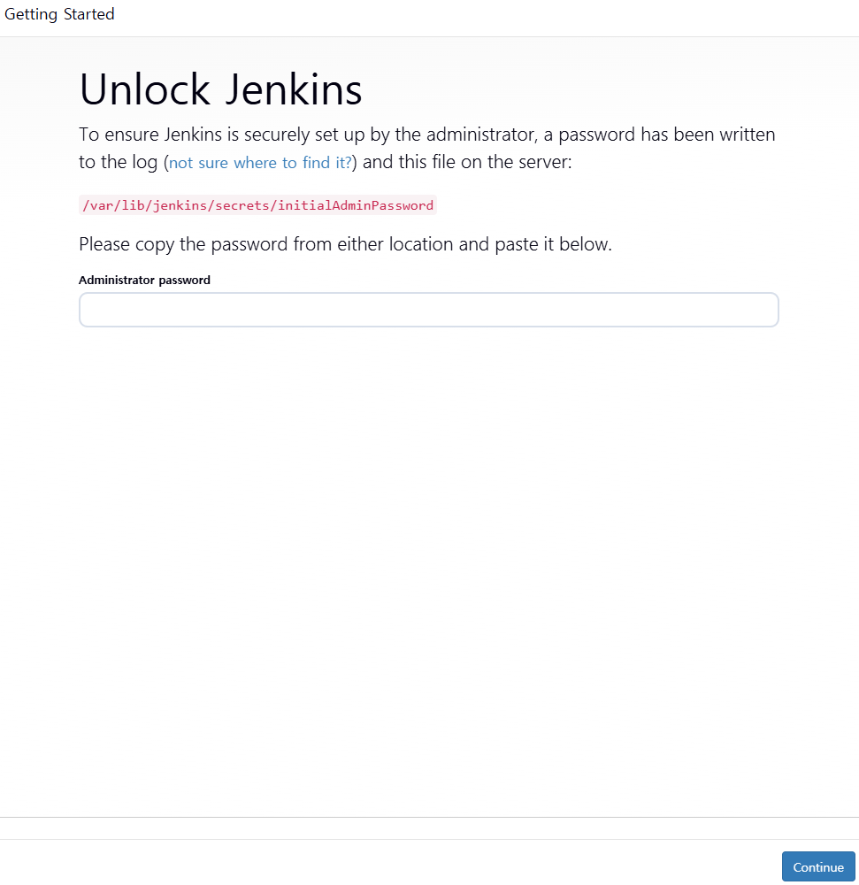

-   비밀번호 확인

```bash
sudo cat /var/lib/jenkins/secrets/initialAdminPassword
```

-   Install suggested plugins(추천 플러그인 설치)
    -   필수 플러그인 설치 확인(Git Plugin, GitHub Plugin, Pipeline Plugin 등)
-   계정 생성
-   Instance Configuration(http://3.107.193.223:9090/ -> Jenkins가 설치된 EC2 인스턴스의 퍼블릭 IP + Jenkins 포트 번호)
-   Create new job
    -   devops-lab-ec2, Pipeline
    -   GitHub proejct(연결하고자 하는 GitHub 경로, https://github.com/INgenious-with/devops-lab-ec2.git)
    -   Triggers 에서 GitHub hook trigger for GITScm polling(GitHub에서 코드가 push 될 때 자동으로 jenkins 빌드 실행)
    -   Pipeline 에서 Definition 부분 Pipeline script from SCM, SCM 부분 Git, Repositry URL 부분 GitHub 경로 입력, Branch Specifier 부분 */main으로 변경, Save
    -   Free Disk Space 용량 부족 시 EC2 루트 볼륨 크기 확장
          ```bash
          # 인스턴스 -> 인스턴스 ID -> 하단 Storage, 볼륨 ID -> 체크 박스 클릭 후 작업, 볼륨 수정 -> 크기(GiB) 값 변경
          # 볼륨은 확장만 가능하고, 축소가 불가하므로 주의하여야 함
          # 단순히 AWS EC2 콘솔에서 EBS 볼륨 크기만 늘려주는 것만으로는 OS가 바로 사용하지 못하여 아래 명령어 필수
          
          sudo dnf install cloud-utils-growpart -y
          sudo growpart /dev/nvme0n1 1  
          sudo xfs_growfs -d /
          df -h # 적용 확인
          ```
          
    -   Free Swap Space 용량 부족 시 디스크 확장
          ```bash
          # Swap Space 디스크 확장
          sudo fallocate -l 4G /swapfile
          sudo chmod 600 /swapfile
          sudo mkswap /swapfile
          sudo swapon /swapfile
          echo '/swapfile swap swap defaults 0 0' | sudo tee -a /etc/fstab # 영구 적용
          swapon --show
          free -h
          sudo systemctl restart jenkins
          ```

    -   Free Temp Space 용량 부족 시 디스크 확장
          ```bash
          # Temp Space 디스크 확장
            df -h /tmp
            sudo mount -o remount,size=4G /tmp
            sudo sed -i '/\/tmp/s/$/ ,size=4G/' /etc/fstab
            sudo systemctl restart jenkins
          ```
                    
    -   우측 상단 Jenkins 관리 -> Nodes -> 이상 없는지 확인
    -   Webhook 설정
        - GitHub -> Repository -> Settings -> Webhooks -> Add webhook -> Payload URL: http://3.107.193.223/:9090/github-webhook/, Content type: application/json -> Add webhook
    -   Jenkins 유저 docker 그룹 추가
       
          ```bash
          sudo usermod -aG docker jenkins
          sudo systemctl restart jenkins
          ```
          
    -   Jenkinsfile 작성 후, FileZilla를 사용하여 해당 경로로 파일 이동
       
         ```bash
         pipeline {
             agent any # 실행할 에이전트를 지정, 'any'는 어떤 에이전트에서도 실행 가능
        
             environment {
                 IMAGE_NAME = "devops-lab-ec2" # Docker 이미지 이름 설정
                 IMAGE_TAG  = "latest" # Docker 이미지 태그 설정
             }
         
             stages {
                 # Git에서 소스 코드 가져오기
                 stage('Git Checkout') {
                     steps {
                         echo "🔹 GitHub에서 코드 가져오기"
                         git branch: 'main', url: 'git@github.com:INgenious-with/devops-lab-ec2.git'
                         echo "✅ Git Checkout 완료"
                     }
                 }
                 # Docker 이미지 빌드
                 stage('Build Docker Image') {
                     steps {
                         echo "🔹 Docker 이미지 빌드 시작"
                         script {
                             try {
                                 # Dockerfile 기반으로 이미지 빌드 및 태그 추가
                                 sh 'docker build -t $IMAGE_NAME:$IMAGE_TAG .'
                                 echo "✅ Docker 이미지 빌드 성공"
                             } catch (err) {
                                 echo "❌ Docker 이미지 빌드 실패"
                                 error("Build failed") # 실패 시 예외 처리
                             }
                         } 
                     }
                 }
                 # Docker 컨테이너 실행
                 stage('Run Container (Test)') {
                     steps {
                         echo "🔹 Docker 컨테이너 실행 및 테스트"
                         script {
                             try {
                                 # 새로 빌드한 이미지를 기반으로 컨테이너 실행
                                 sh 'docker run --rm $IMAGE_NAME:$IMAGE_TAG echo "컨테이너 테스트 성공!"'
                                 echo "✅ Docker 컨테이너 테스트 성공"
                             } catch (err) {
                                 echo "❌ Docker 컨테이너 테스트 실패"
                                 error("Test failed") # 실패 시 예외 처리
                             }
                         }
                     }
                 }
                 # Docker 이미지 정리
                 stage('Clean Up') {
                     steps {
                         echo "🔹 Docker 이미지 정리"
                         # 빌드한 Docker 이미지 삭제
                         sh 'docker rmi $IMAGE_NAME:$IMAGE_TAG || true'
                         echo "✅ Clean up 완료"
                     }
                 }
             }
        
             post {
                 success {
                     echo "🎉 전체 빌드 성공!"
                 }
                 failure {
                     echo "⚠️ 전체 빌드 실패!"
                 }
             }
          ```
         
          ```bash
          cd ~/devops-lab-ec2  # 디렉터리 이동, JenkinsFile 해당 경로로 옮기기
          # 해당 경로에 index.html 파일 내용 수정
          git status
          git add .
          git commit -m "Push 시, Jenkins 자동 빌드 확인"
          ```
    -   푸쉬 시 Jenkins가 자동으로 빌드 수행 확인
       
        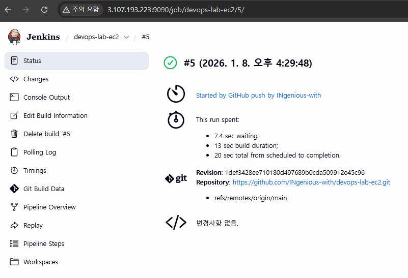

✨ 느낀 점

Jenkins 설치와 초기 설정을 직접 진행하며, 빌드 자동화 환경에서 발생할 수 있는 문제를 확인하고 해결하는 경험을 얻을 수 있었음

AWS에서 포트, 디스크, 메모리, 권한 등을 조정하며, 클라우드 서비스 운영에 필요한 세밀한 시스템 관리 능력을 체감할 수 있었음

GitHub 연동과 Pipeline 구성으로 코드 변경 시 자동으로 빌드되는 흐름을 확인하며, CI(Continuous Integration) 역할과 중요성을 이해할 수 있었음

<br><br>

# Chapter 5 - Docker 자동 빌드 및 재시작 설정

### 1. Jenkinsfile 수정

```bash
pipeline {
    agent any

    environment {
        IMAGE_NAME = "devops-lab-ec2" # Docker 이미지 이름 설정
        IMAGE_TAG  = "latest" # Docker 이미지 태그 설정
        CONTAINER_NAME = "my-nginx" # Docker 컨테이너 이름 설정
        PORT = "8081" # 외부와 연결할 포트 설정
    }

    stages {
        # Git에서 소스 코드 가져오기
        stage('Git Checkout') {
            steps {
                echo "🔹 GitHub에서 코드 가져오기"
                git branch: 'main', url: 'https://github.com/INgenious-with/devops-lab-ec2.git'
                echo "✅ Git Checkout 완료"
            }
        }
        # Docker 이미지 빌드
        stage('Build Docker Image') {
            steps {
                echo "🔹 Docker 이미지 빌드 시작"
                script {
                    try {
                        # Dockerfile 기반으로 이미지 빌드 및 태그 추가
                        sh 'docker build -t $IMAGE_NAME:$IMAGE_TAG .'
                        echo "✅ Docker 이미지 빌드 성공"
                    } catch (err) {
                        echo "❌ Docker 이미지 빌드 실패"
                        error("Build failed") # 실패 시 예외 처리
                    }
                }
            }
        }
        # 기존 Docker 컨테이너 중지 및 삭제
        stage('Stop and Remove Old Container') {
            steps {
                echo "🔹 기존 Docker 컨테이너 중지 및 삭제"
                script {
                    try {
                        # 기존 컨테이너가 실행 중이면 강제로 종료하고 삭제
                        sh '''
                            CONTAINER_ID=$(docker ps -q -f name=$CONTAINER_NAME)
                            if [ ! -z "$CONTAINER_ID" ]; then
                                echo "기존 컨테이너가 존재합니다. 중지 및 삭제합니다."
                                docker stop $CONTAINER_NAME || true  # 실행 중인 컨테이너 종료
                                docker rm $CONTAINER_NAME || true    # 컨테이너 삭제
                                docker kill $CONTAINER_NAME || true  # 강제로 종료
                            else
                                echo "기존 컨테이너가 없습니다."
                            fi
                        '''
                        echo "✅ 기존 컨테이너 중지 및 삭제 완료"
                    } catch (err) {
                        echo "❌ 기존 컨테이너 중지 및 삭제 실패"
                        error("Failed to stop and remove old container") # 실패 시 예외 처리
                    }
                }
            }
        }
        # Docker 컨테이너 실행    
        stage('Run New Container') {
            steps {
                echo "🔹 새 Docker 컨테이너 실행"
                script {
                    try {
                        # 새로 빌드한 이미지를 기반으로 컨테이너 실행
                        sh 'docker run -d --name $CONTAINER_NAME -p $PORT:80 $IMAGE_NAME:$IMAGE_TAG'
                        echo "✅ 새 Docker 컨테이너 실행 성공"
                    } catch (err) {
                        echo "❌ 새 Docker 컨테이너 실행 실패"
                        error("Failed to run new container") # 실패 시 예외 처리
                    }
                }
            }
        }
        # Docker 이미지 정리
        stage('Clean Up') {
            steps {
                echo "🔹 Docker 이미지 정리"
                # 빌드한 Docker 이미지 삭제
                sh 'docker rmi $IMAGE_NAME:$IMAGE_TAG || true'
                echo "✅ Clean up 완료"
            }
        }
    }

    post {
        success {
            echo "🎉 전체 빌드 성공!"
        }
        failure {
            echo "⚠️ 전체 빌드 실패!"
        }
    }
}
```

### 2. 빌드 결과 확인

-   푸시 후 Docker 이미지가 자동으로 빌드되고, 컨테이너가 재시작되는지 확인
    -   푸쉬 전 Docker에서 확인한 index.html
      
    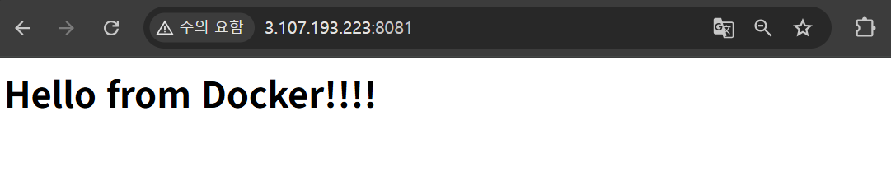

    -   Jenkins 빌드 진행 상태 확인
   
    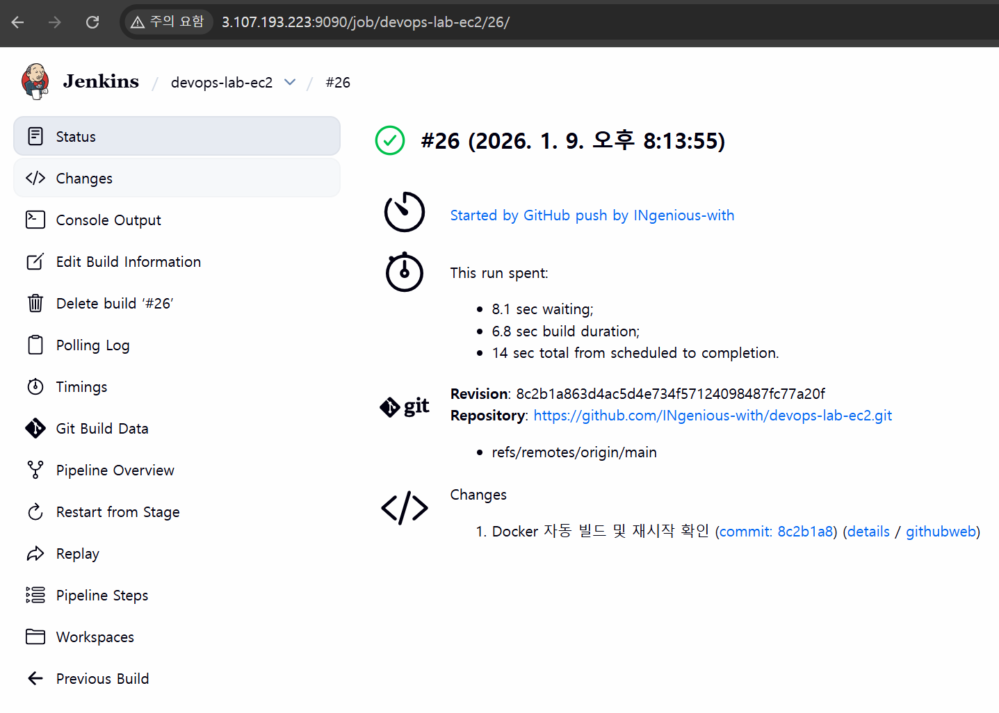

    -   푸쉬 후 Docker에서 확인한 index.html

    

✨ 느낀 점

Jenkinsfile을 수정하여 Docker 자동 빌드 및 재시작 설정을 진행하며, 빌드 자동화에서 발생할 수 있는 문제를 해결하는 역량을 키울 수 있었음

기존 컨테이너 중지 및 삭제 과정을 반복하면서, Jenkins와 Docker의 연동을 좀 더 깊이 이해할 수 있었음

CI/CD 파이프라인 설정을 통해 코드 변경 시 자동으로 빌드되는 흐름을 확인하며, DevOps 환경에서의 자동화의 중요성을 실감할 수 있었음

<br><br>

# Chapter 6 - Terraform, Ansible 적용(프리티어 버전)

### 1. AWS 자격 정보(Credentials) 설정

-   AWS 로그인 후 우측 상단 계정 명 클릭 후, 보안 자격 증명 클릭 -> 액세스 키 만들기 -> 체크박스 클릭 후 -> 엑세스 키 만들기 -> 엑세스 키, 비밀 엑세스 키 확인 및 저장
    -   엑세스 키는 한번만 표시되므로 반드시 복사해서 메모장 등에 안전하게 보관
  
```bash
aws --version # 버전 확인

aws configure # 자격 정보 설정
순서대로 입력
AWS Access Key ID [None]: 발급 받은 액세스 키
AWS Secret Access Key [None]: 발급 받은 비밀 액세스 키
Default region name [None]: ap-northeast-2(고정)
Default output format [None]: json(고정)

cat ~/.aws/credentials # 설정 확인
```
### 2. Terraform 설치

```bash
sudo dnf install -y unzip
wget https://releases.hashicorp.com/terraform/1.7.3/terraform_1.7.3_linux_amd64.zip
unzip terraform_1.7.3_linux_amd64.zip
sudo mv terraform /usr/local/bin/
terraform -version # 설치 확인

mkdir devops-lab-terraform
cd devops-lab-terraform # 폴더 생성 및 경로 이동
```

### 3. main.tf 파일 생성

```bash
cat <<'EOF' > main.tf
provider "aws" {
  region = "ap-northeast-2" # 서울 리전
}

# 프리티어 인스턴스 설정
resource "aws_instance" "devops_ec2" {
  ami           = "ami-00283f7a0e73c4494"  # Amazon Linux 2023 (Free Tier)
  instance_type = "t3.micro"               # 프리티어 가능
  key_name      = "injin-key"              # 기존 키페어 이름 (콘솔에서 발급한 것)

  root_block_device {
    volume_size = 30                       # 30GB (프리티어 30GB 이내)
    volume_type = "gp3"
  }

  vpc_security_group_ids = [aws_security_group.devops_sg.id]

  tags = {
    Name = "devops-lab-free-tier"
  }
}

# 필수 포트만 허용 (SSH, HTTP, HTTPS)

resource "aws_security_group" "devops_sg" {
  name        = "devops-sg"
  description = "Allow SSH, HTTP, HTTPS"

  ingress {
    description = "Allow SSH"
    from_port   = 22
    to_port     = 22
    protocol    = "tcp"
    cidr_blocks = ["0.0.0.0/0"]
  }

  ingress {
    description = "Allow HTTP"
    from_port   = 80
    to_port     = 80
    protocol    = "tcp"
    cidr_blocks = ["0.0.0.0/0"]
  }

  ingress {
    description = "Allow HTTPS"
    from_port   = 443
    to_port     = 443
    protocol    = "tcp"
    cidr_blocks = ["0.0.0.0/0"]
  }

  egress {
    description = "Allow all outbound traffic"
    from_port   = 0
    to_port     = 0
    protocol    = "-1"
    cidr_blocks = ["0.0.0.0/0"]
  }
}

output "public_ip" {
  value = aws_instance.devops_ec2.public_ip
}
EOF
```

### 3. Terraform 초기화, 실행 전 미리보기

```bash
terraform init # 초기화
terraform plan # 실행 전 미리보기
```

### 4. Terraform 실제 리소스 생성 및 확인

```bash
# 서울 리전에 키 페어가 없다면 아래 명령어 실행
aws ec2 create-key-pair \
  --key-name injin-key \
  --query 'KeyMaterial' \
  --output text > injin-key.pem \
  --region ap-northeast-2

chmod 400 injin-key.pem

terraform apply -auto-approve # 실제 리소스 생성
terraform output # EC2 Public IP 정보 확인
```

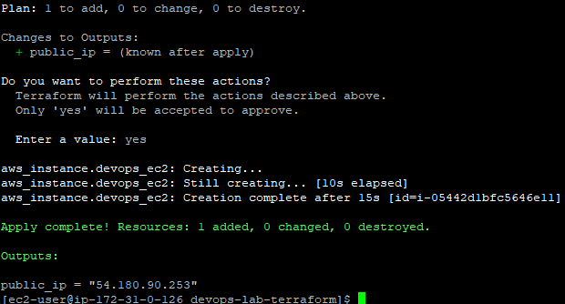

### 5. SSH 접속 확인
```bash
ssh -i ~/path/to/injin-key.pem ec2-user@54.180.90.253
```

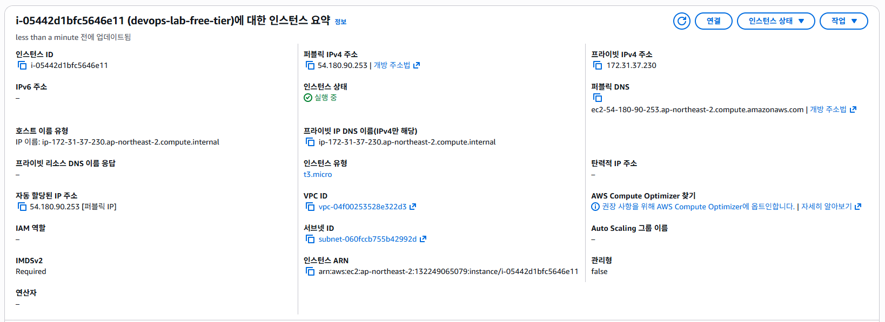


-   Jenkins는 Java로 개발된 애플리케이션으로, 실행을 위해서 JDK를 먼저 설치하여야 함(Amazon Linux 2023은 JDK 17 이상 필수)

# AWS EC2와 Docker/Jenkins를 활용한 시스템 자동화 프로젝트 🖊

클라우드 환경에서의 시스템 구축, 자동화, 효율적인 관리 방법을 실제로 적용하며 DevOps의 핵심 개념을 깊이 이해할 수 있었습니다.

와이드큐브에서 쌓은 실무 경험을 통해, 클라우드 환경에서 DevOps 기술을 확장할 수 있는 중요한 방향성을 파악하게 되었습니다.

AWS EC2 환경 구축부터 Nginx 설치, GitHub와의 연동, Docker와 Jenkins를 활용한 자동화 파이프라인 설정까지, 클라우드 환경에서 시스템 구축과 관리에 필요한 핵심 기술을 익혔습니다.

특히, Docker와 Jenkins를 활용한 자동화된 빌드, 배포 및 환경 구축 과정이 인상 깊었으며, 실무에서 이를 어떻게 활용할 수 있을지에 대한 이해가 깊어졌습니다.

이번 개인 프로젝트를 통해 클라우드 환경과 자동화 도구를 효과적으로 활용하는 실무 능력을 쌓을 수 있었고, 이 경험은 클라우드 환경에서 필요한 역량을 갖추는데 중요한 밑거름이 되었습니다.

<br><br>
