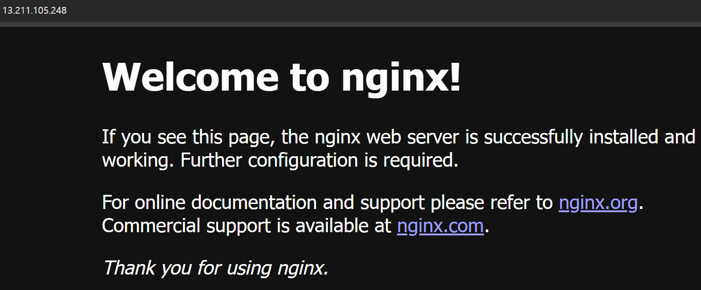

# Day 1 - AWS EC2 & Nginx Setup

## 진행 사항

### 1. AWS 환경 준비

-   AWS 계정 생성 및 프리 티어 활성화
-   EC2 인스턴스 생성(t3.micro)
    -   OS: Amazon Linux 2023 kernel-6.1 AMI
    -   보안그룹: SSH(22), HTTP(80), HTTPS(443) 허용

### 2. 기본 패키지 업데이트

```bash
sudo yum update -y
```

### 3. 웹 서버 설치 및 확인

```bash
sudo yum install nginx -y
sudo systemctl start nginx
sudo systemctl enable nginx
sudo systemctl status nginx
```

-   브라우저 접속: http://13.211.105.248/
-   Nginx 기본 화면 ("Welcome to Nginx) 확인

    

### 4. Git 연결

-   GitHub Repository 생성
-   EC2에서 OpenSSH 키 생성 및 GitHub SSH Keys 등록

```bash
ssh-keygen -t ed25519 -C "injin0318@gmail.com"
cat ~/.ssh/id_ed25519.pub  # GitHub에 복사
```

-   Git 초기화 및 원격 연결

```bash
git init
git remote add origin git@github.com:INgenious-with/devops-lab-ec2.git
```

✨ 느낀 점

AWS EC2를 직접 생성하고 Nginx를 띄워보면서
서버 환경이 어떻게 구성되고 인터넷으로 노출되는지를 실감할 수 있었음.
특히 보안그룹 설정의 중요성을 직접 체험하며, 인프라 관리의 기본 흐름을 이해하게 됨

# Day2 - Docker 기초 및 커스텀 이미지 빌드

## 진행 사항

### 1. Docker 설치 및 실행

```bash
sudo yum install docker -y
sudo systemctl start docker
sudo systemctl enable docker
sudo usermod -aG docker ec2-user
```

-   그룹 반영을 위해 로그아웃 후 재접속 또는 newgrp docker

### 2. 기본 컨테이너 실행 확인

```bash
docker run -d -p 8080:80 nginx
docker ps
```

-   브라우저 접속: http://13.211.105.248:8080
-   "Welcome to Nginx" 문구 확인

    

### 3. 커스텀 Docker 이미지 빌드

-   index.html 생성

```bash
echo '<h1>Hello from Docker!</h1>' > index.html
```

-   Dockerfile 작성

```bash
echo -e "FROM nginx\nCOPY index.html /usr/share/nginx/html/" > Dockerfile
```

-   이미지 빌드

```bash
docker build -t my-nginx .
```

-   커스텀 컨테이너 실행

```bash
docker run -d -p 8081:80 my-nginx
```

-   브라우저 접속: http://13.211.105.248:8081
-   "Hello from Docker!" 문구 확인

    

✨ 느낀 점

Dockerfile을 직접 작성해보며 이미지와 컨테이너의 차이를 명확히 이해할 수 있었음
기존 서버 설정 과정을 단 몇 줄의 코드로 재현할 수 있다는 점이 인상적이었고,
'환경을 코드로 관리한다'는 DevOps 철학의 시작점을 체감함
